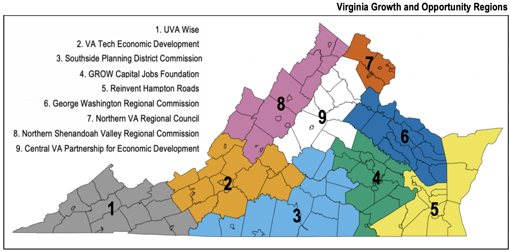
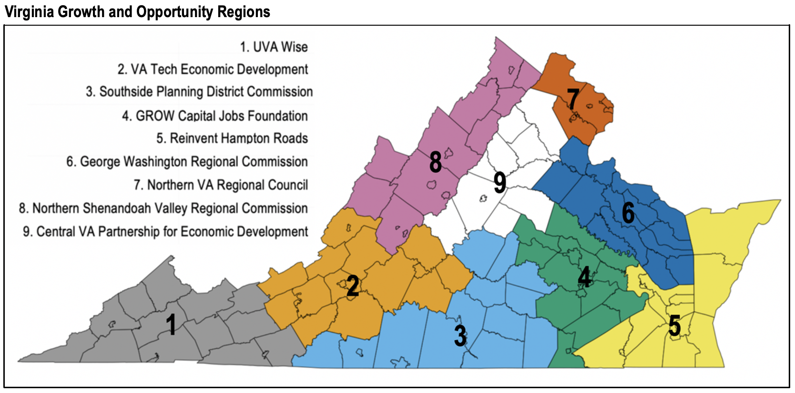

```{r, echo=FALSE, out.width = '80%', fig.align='center'}

```

Interactive treemaps are used to explore employer skill and certification demands across the nine [Virginia Growth and Opportunity Regions](https://govirginia.org/about/) (GO Regions) using job-ads. Virginia has a diverse array of industries, from computer services and cybersecurity in Region 7, ship building and repair in Region 5, and energy and minerals in Region 1. 

The first tab, Job-ad Density, displays Burning Glass Technology job-ads organized by the [Bureau of Labor Statistics’ 23 Major Occupation Groups](https://www.bls.gov/oes/current/oes_stru.htm) (MOG) for each GO Region using treemaps. The size of the rectangle is a function of the number of job-ads and the color indicates the average salary. Clicking on one of the major occupations groups displays the job-ad treemap for the occupations within the MOG. Below the treemap are salary density plots for each of the major occupation groups.

The second tab, Skill Density, displays treemaps organized by the Burning Glass Technology skill taxonomy for each GO Region. The skills listed in job-ads are canonicalized to improve categorization which allows each skill to be categorized into one of the 657 skill clusters which is a grouping of skills that have similar functionality and/or frequently appear together in job-ads and one of the 28 skill cluster families. The most general classification of the Burning Glass Technologies skill taxonomy is the skill cluster family, each skill and skill cluster belong to exactly one family. 

*	The first layer of the treemap displays the skill cluster family where the size of the rectangle is a function of the number of job-ads requesting skills in that particular skill cluster family and the color indicates the average salary. 

* Clicking on a skill cluster family brings up the second layer of the treemap, skill clusters.

* Clicking on a skill cluster brings up the third layer of the treemap, skills. 


The third tab, Certification Density, displays the certificates in job-ads by organized by GO Region using treemaps. A certification is a nondegree credential awarded by a certification body based on an individual demonstrating through an examination process they have acquired the knowledge, skills, and abilities to perform a specific job. The examination can be either written, oral, or performance-based ([National Center for Education Statistics](https://nces.ed.gov/surveys/gemena/definitions.asp)). The Department of Labor’s [CareerOneStop](https://www.careeronestop.org/Developers/Data/certifications.aspx) contains 11,556 unique industry-recognized certifications.   

*	The first layer of the treemap displays the number of job-ads requesting certifications by GO Region.

*	The second layer of the treemap displays the major occupation groups requesting certifications.

*	The third layer of the treemap displays the occupations within the major occupation group requesting certifications. 

*	The fourth layer displays the certifications requested in job-ads for that occupation.


<!---

This repository includes the information of job ads, certifications, and skills for the State of Virginia.

The information source is Burning Glass Technology (BGT) for 2019. BGT includes more than 1,026,0000 job ads for 2019, with almost 470,000 certifications (1,684 unique certifications) across all occupations. In addition, the data base contains more than 10 million skills. 

The information is presented for nine distinct regions across Virginia, named as the VA GO Regions according to the Virginia Growth and Opportunity Board.  These regions share similarities of geography, workforce, and economic development.  
knitr::include_graphics("GO-VA-Map.png")
Source: Virginia Growth and Opportunity Board 

```{r, echo=FALSE, out.width = '80%'}

```

-->


 


