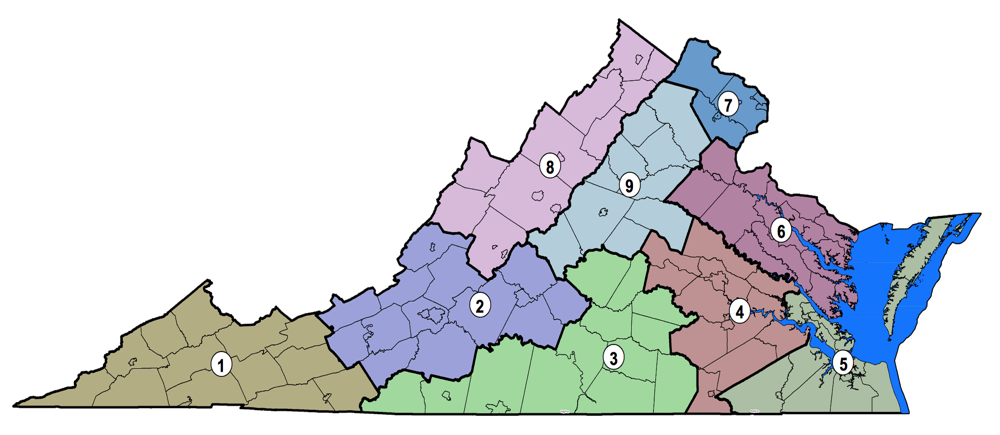

    
This repository includes the information of job ads, certifications, and skills for the State of Virginia.

The information source is Burning Glass Technology (BGT) for 2019. BGT includes more than 1,026,0000 job ads for 2019, with almost 470,000 certifications (1,684 unique certifications) across all occupations. In addition, the data base contains more than 10 million skills. 

The information is presented for nine distinct regions across Virginia, named as the VA GO Regions according to the Virginia Growth and Opportunity Board.  These regions share similarities of geography, workforce, and economic development.  
 

```{r, echo=FALSE, out.width = '80%'}


```


Source: Virginia Growth and Opportunity Board 


