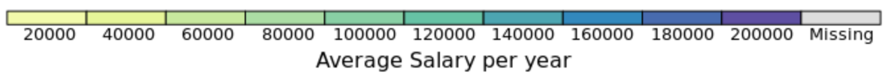

```{r setup, include=FALSE}
knitr::opts_chunk$set(echo = TRUE)
```


```{r, echo=FALSE, warning=FALSE, message=FALSE, fig.show='hide'}
library(dplyr)
library(readr)
library(tidyverse)
library(treemap)
library(d3treeR)


#data
#data_skills_scf_sc_s_va_region <- read_csv("~/STW/BGT/va_go_regions/va_go_bgt/data_skills_scf_sc_s_va_region.csv")
data_jobs_va_region <- read_csv("~/STW/BGT/va_go_regions/va_go_bgt/data_jobs_va_region.csv")

job_Reg1 <- treemap(data_jobs_va_region %>% dplyr::filter(va_region == 2) ,
                     index=c("occfamname", "onetname" ),
                     vSize="num",
                     vColor="salary",
                     type="value",
                     fun.aggregate = 'mean',
                     palette = "Spectral",
                     overlap.labels = 1,
                     title="Job Ads Density per Region in VA, 2019",
                     title.legend = "Average Salary per year",
                     na.rm = TRUE
        )
```


```{r, echo=FALSE, warning=FALSE, message=FALSE, fig.show='hide'}
#knitr::include_graphics("GO-VA-Map.png")

d3tree2( job_Reg1 ,  rootname = "Job Ads" )

```


```{r, echo=FALSE, out.width = '80%'}

```


```{r, echo=FALSE, warning=FALSE, message=FALSE, fig.show='hide'}
library(dplyr)
library(readr)
library(tidyverse)
library(treemap)
library(d3treeR)
library(ggridges)
library(ggplot2)
library(viridis)


salary_Reg1 <- ggplot(data_jobs_va_region %>% filter(va_region== 1, !is.na(occfamname_corr)), aes(x = salary, y = occfamname_corr, fill = ..x..)) +
            #stat_density_ridges(quantile_lines = TRUE) +
            geom_density_ridges_gradient(scale = 3, rel_min_height = 0.01) +
            scale_fill_viridis(name = "Salary", option = "D") +
            labs(title = 'Distribution of salaries by Occupation Group, 2019', x ="Salary (dollars)", y = "Occupation group") +
            #theme_ipsum() +
            theme(
                legend.position="none",
                panel.spacing = unit(0.1, "lines"),
                strip.text.x = element_text(size = 8)
            ) 

```

```{r, echo=FALSE, message = FALSE}
salary_Reg1
```


Source: Burning Glass Technology, 2019.

